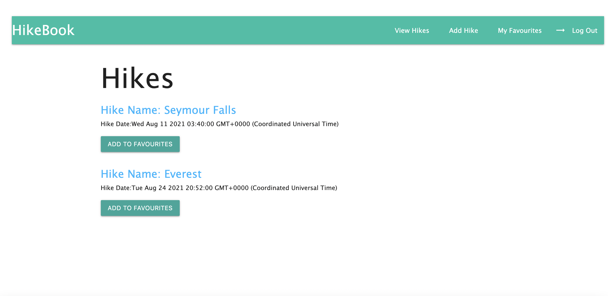
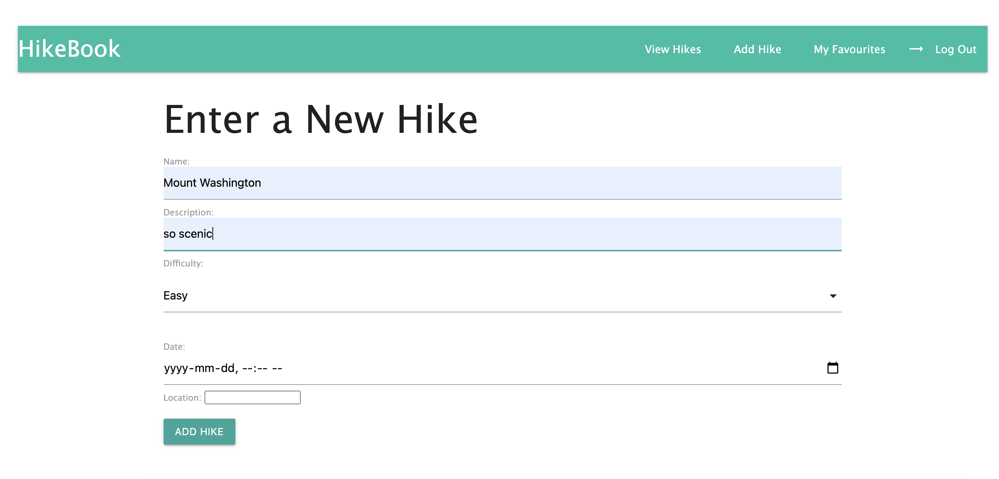
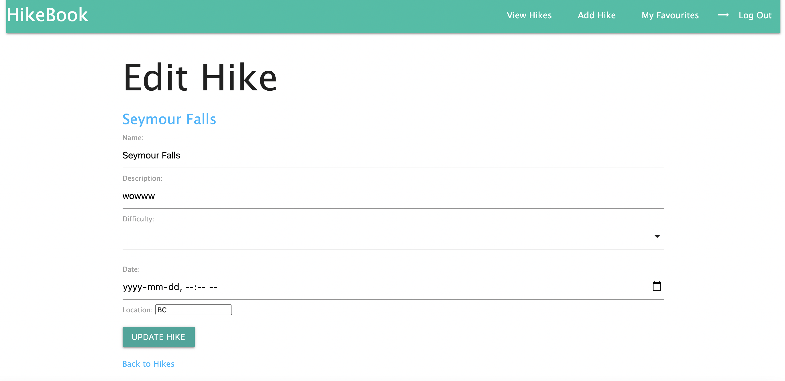

## HikeBook

```
HikeBook is a full stack application that enables users to add to a detailed database of hikes. Users can favourite hikes for their own custom list and have the ability to add, edit, or delete hikes based on their preferences. Enjoy and explore!
```

## SCREENSHOTS





## TECHNOLOGIES USED

### The technologies used for this project were:

- HTML
- JavaScript
- Node.js
- Express.js
- Mongoose
- Materialize.css

## GETTING STARTED

[HikeBook on Heroku](https://hike-book.herokuapp.com/)

**Upload your favourite hikes!**

## NEXT STEPS

### What features would I like to implement:


- [ ] implement uploading photos of hikes
- [ ] implement location pinning on a map to easily find diretions to hikes
- [ ] implement social media and sms sharing to share hikes with friends


:camel: